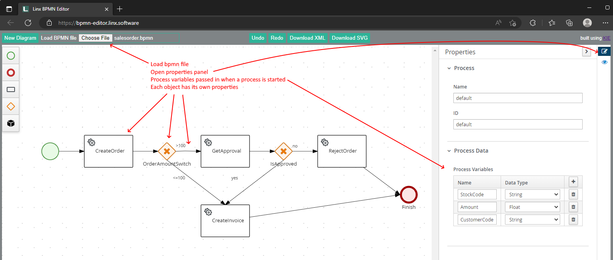

# Readme

## Overview
This project shows how to build a simple sales order business process using Linx and the ProcessAutomation plugin, testing the process with automated tests, and exposing the process to a UI through a REST API.

## Business process
The sales order process:


1. A sales order is created by passing in a customer code, stock code, and amount. 
1. If the amount is > 100, approval is required
1. If the amount is <= 100 or is approved, an invoice is created
1. If the order is not approved, it gets rejected.

All the steps are automated except for the approval step. When the order requires approval, the process stops until approval is completed.

The Linx editor view:


## Getting it running

### Prerequisites
- Linx vNext
- MS SqlServer 2022

### Run the tests
1. Create the database with \db\create-db.sql.
1. Open \Linx\SalesOrderAutomation.solution in Linx Editor.
1. In Settings, change the value of Db to your database connectionstring.
1. The test runner does not have access to secret settings, so we have to supply it with a separate settings file to override the default. To create the file
    1. Create a new folder called .test_files in the Linx folder
    1. Uncheck the Secret checkbox next to Db and save the solution
    1. Copy file App.settings to \Linx\\.test_files
    1. Check the Secret checkbox next to Db and save the solution
1. Open Powershell and run 
```
& "C:\Program Files\Twenty57 Linx Designer 6 vNext\TestRunner\Twenty57.Linx.TestRunner.Console.exe" -solutionPath "[RootFolder]\Linx\" -settingsFilePath "[RootFolder]\Linx\.test_files\App.settings"
```

All the tests should pass. You can have a look at the contents of the database tables Orders, WorkflowInstances, and WorkflowExecutionLogRecords to see what the data looks like.

There are no automated tests for the API. Feel free to add them...

### Deploy and use the UI

#### Set the API URI ####

The default URI for the API is http://localhost:9001/. If you want to change this
1. In the Linx solution under Settings, set API_URI to the new value.
1. In SalesOrderDemo.html under the script tag, set API_URI to the new value.

#### Deploy and check the endpoints ####

Deploy the solution to your Linx Server and start the Services. Once they're started you can test the endpoints with a browser. Here are some sample urls:
- http://localhost:9001/create-order?customercode=custA&stockcode=stock1&amount=99
- http://localhost:9001/get-order?id=[orderId]
- http://localhost:9001/log?orderid=[orderId]
- http://localhost:9001/approve?id=[orderId]&approve=true

#### Use the UI ####

Run SalesOrderDemo.html to exercise the process through a UI.

## Building from scratch

### Design the process

Design the process using this bpmn editor: https://bpmn-editor.linx.software/. Load salesorder.bpmn to see the process flow. Each object has properties as shown in the screenshot below.


All tasks are by default synchronous. To create an asynchronous task (typically for long running or manual tasks), check the Is Async property. The GetApproval task is asynchronous and only completes when the Complete_GetApproval function is called.

### Add the process to Linx

Open or create a Linx solution and add the ProcessAutomation plugin. Add the Process Service to the solution, download the XML from the bpmn editor, and paste the bpmn XML into the Definition property of the Process Service. This will create events for all the bpmn tasks and functions to interact with the Service.

Set the database type and connection on the Process Service properties.

Preliminary docs for the ProcessAutomation Service can be found here: http://staging.linx.software/docs/6/reference/plugins/processautomation/overview/.

### Implement and test

Debugging the Process Service itself in Linx Designer is not useful because Linx does not support running functions on services in the debugger. The only (and probably better) way to debug the Process Service is to write tests. For instructions on how to use the test runner see https://linx.software/docs/6/reference/testrunner/testrunner/.

For each Process event:
1. Write a test
2. Run the test - it should fail
3. Implement the logic for the event
4. Run the test - it should pass

The Process Service uses internal worker threads to execute tasks. To wait for these tasks to complete before testing the results, check the status of the process instance. The WaitForProcessStatus function in the Test_Process folder encapsulates this logic and is called by all the tests to wait for 'Finished' or 'Suspended' statuses.

## Sundry rambling

The ProcessAutomation Service is useful to control the process and keep state. It is not intended to be a repository for business data. At the moment we are passing in more data than is required by the process, so we could further refactor this by creating the order outside the process and then starting the process by passing in only the OrderId and Amount.

I found the tests to be very useful when changing the solution and upgrading Linx components. Running the tests after every refactor or component upgrade made finding problems much easier and gave me confidence when making more ambitious changes.

## Repo contents

- \db: database scripts
- \Linx: Linx solution
- salesorder.bpmn: Sales order business process definition
- SalesOrderDemo.html: Web page to exercise the functionality in the Linx solution