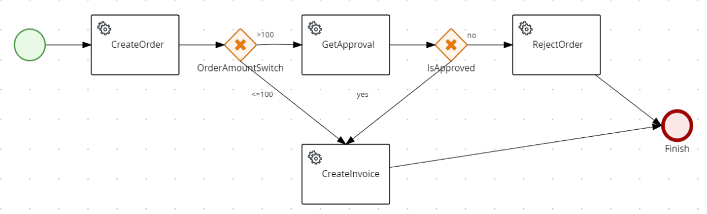
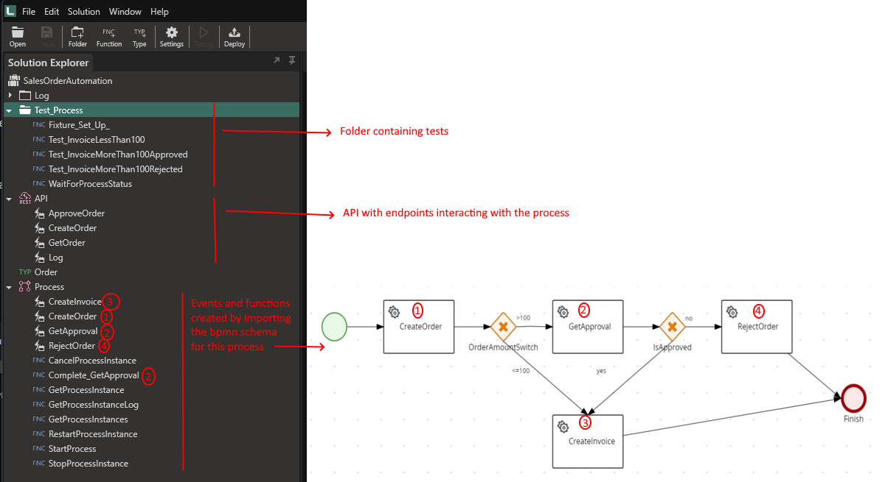

# Readme

## Overview
This project shows how to build a simple sales order business process using Linx and the ProcessAutomation plugin, testing the process with automated tests, and exposing the process to a UI through a REST API.

## Business process
The sales order process:


1. A sales order is created by passing in a customer code, stock code, and amount. 
1. If the amount is > 100, approval is required
1. If the amount is <= 100 or is approved, an invoice is created
1. If the order is not approved, it gets rejected.

All the steps are automated except for the approval step. When the order requires approval, the process stops until approval is completed.

The Linx editor view:


## Getting it running

### Prerequisites
- Linx vNext
- MS SqlServer 2022

### Run the tests
1. Create a database and run the script \db\create-db-objects.sql to create the database objects.
1. Open \Linx\SalesOrderAutomation.solution in Linx Editor.
1. In Settings, change the value of Db to your database connectionstring.
1. The test runner does not have access to secret settings, so we have to supply it with a separate settings file to override the default. To create the file
    1. Create a new folder called .test_files in the Linx folder
    1. Uncheck the Secret checkbox next to Db and save the solution
    1. Copy file App.settings to \Linx\\.test_files
    1. Check the Secret checkbox next to Db and save the solution
1. Open Powershell and run 
```
& "C:\Program Files\Twenty57 Linx Designer 6 vNext\TestRunner\Twenty57.Linx.TestRunner.Console.exe" -solutionPath "[RootFolder]\Linx\" -settingsFilePath "[RootFolder]\Linx\.test_files\App.settings"
```

All the tests should pass. You can have a look at the contents of the database tables Orders, WorkflowInstances, and WorkflowExecutionLogRecords to see what the data looks like.

There are no automated tests for the API. Feel free to add them...

### Deploy and use the UI

#### Set the API URI ####

The default URI for the API is http://localhost:9001/. If you want to change this
1. In the Linx solution under Settings, set API_URI to the new value.
1. In SalesOrderDemo.html under the script tag, set API_URI to the new value.

#### Deploy and check the endpoints ####

Deploy the solution to your Linx Server and start the Services. Once they're started you can test the endpoints with a browser. Here are some sample urls:
- http://localhost:9001/create-order?customercode=custA&stockcode=stock1&amount=99
- http://localhost:9001/get-order?id=[orderId]
- http://localhost:9001/log?orderid=[orderId]
- http://localhost:9001/approve?id=[orderId]&approve=true

#### Use the UI ####

Run SalesOrderDemo.html to exercise the process through a UI.

## Building from scratch

### Design the process
https://bpmn-editor.linx.software/

### Add the process to Linx
http://staging.linx.software/docs/6/reference/plugins/processautomation/overview/

### Implement and test
https://linx.software/docs/6/reference/testrunner/testrunner/

## Sundry rambling

The ProcessAutomation Service is useful to control the process and keep state. It is not intended to be a repository for business data. Following this logic, I should rather create the order outside of the Process and start it by passing in the OrderId and Amount - not all the data required for the order.

## Repo contents

- \db: database scripts
- \Linx: Linx solution
- salesorder.bpmn: Sales order business process definition
- SalesOrderDemo.html: Web page to exercise the functionality in the Linx solution